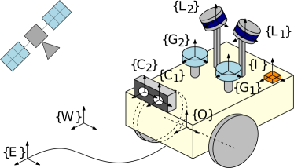

# MINS
[](https://github.com/rpng/MINS/actions/workflows/docker-image.yml)

An efficient, robust, and tightly-coupled **Multisensor-aided Inertial Navigation System (MINS)** which is capable of 
flexibly fusing all five sensing modalities (**IMU**, **wheel** **encoders**, **camera**, **GNSS**, and **LiDAR**) in a filtering 
fashion by overcoming the hurdles of computational complexity, sensor asynchronicity, and intra-sensor calibration. 

Exemplary use case of MINS: 
* VINS (mono, stereo, multi-cam)
* GPS-IMU (single, multiple)
* LiDAR-IMU (single, multiple)
* wheel-IMU
* Camera-GPS-LiDAR-wheel-IMU or more combinations.




* Publication reference - [https://arxiv.org/pdf/2309.15390.pdf](https://arxiv.org/pdf/2309.15390.pdf)
  
## Key Features
* Inertial(IMU)-based multi-sensor fusion including wheel odometry and arbitrary numbers of cameras, LiDARs, and GNSSs (+ VICON or loop-closure) for localization.
* Online calibration of all onboard sensors (check [exemplary results](https://github.com/rpng/mins/blob/master/mins_eval/ReadMe.md#run-example)).
* Consistent high-order state on manifold interpolation improved from our prior work ([MIMC-VINS](https://ieeexplore.ieee.org/abstract/document/9363450)) and dynamic cloning strategy for light-weight estimation performance.
* Multi-sensor simulation toolbox for IMU, camera, LiDAR, GNSS, and wheel enhanced from our prior work ([OpenVINS](https://github.com/rpng/open_vins))
* Evaluation toolbox for consistency, accuracy, and timing analysis.
* Very detailed [options](https://github.com/rpng/mins/tree/master/mins/src/options) for each sensor enabling general multi-sensor application.

## Dependency
MINS is tested on Ubuntu 18 and 20 and only requires corresponding ROS ([Melodic](https://wiki.ros.org/melodic) and [Noetic](https://wiki.ros.org/noetic)).
* Default Eigen version will be 3.3.7 (Noetic) or lower, but if one has a higher version the compilation can be failed due to thirdparty library (libpointmatcher) for LiDAR.

## ROS2

For instructions and dependencies for building the package on ros2 you can look into the Dockerfile. After building and sourcing, you should be able to start the simulation with 

```sh
ros2 run mins simulation mins/config/simulation/config.yaml
```

You can then start rviz2 to look at the path as estimated through MINS.

For running in real mode you can use:

```sh
ros2 run mins subscribe mins/config/shanks/config.yaml
```

And then play a bag in another terminal, for example from the [euroc_mav](https://projects.asl.ethz.ch/datasets/doku.php?id=kmavvisualinertialdatasets), after converting it using [rosbags](https://pypi.org/project/rosbags/):

```sh
ros2 bag play maggi_bag/magg_1
```

Again, you can look at the paths and the pose estimated by MINS with rviz2.
